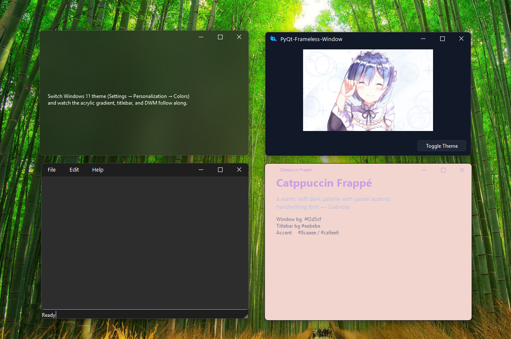

<h1 align="center">
  
  PyQt6-Fluent
</h1>
<p align="left">
Fluent Design component library for PyQt6 — frameless windows, 3‑tier design tokens, Win11 acrylic/mica, live dark/light theming.
</p>

<p align="center">
<a style="text-decoration:none">

</a>
<a style="text-decoration:none">

</a>
<a style="text-decoration:none">

</a>
<a style="text-decoration:none">

</a>
</p>

---

## ✨ Features

- **Frameless window** — drag, resize, snap, Win11 snap layouts
- **3‑tier design‑system tokens** — Palette (primitives) → Semantic (roles) → Component (mappings)
- **Live theme engine** — switch light/dark/custom at runtime, all widgets update instantly via `ThemeObserver`
- **Acrylic / Mica** — Win11 background blur materials (acrylic, mica, mica alt)
- **Theme-aware titlebar** — auto-dark/light, red close button, drag regions
- **DPI-aware** — scaling, multi-monitor, auto-hide taskbar
- **Screen capture filter** — protect sensitive windows
- **WebEngine support** — frameless `QWebEngineView` integration


---

## 🖼️ Preview

<p align="center">
  
</p>

---

## 🔮 Upcoming Widgets

Widget families planned to ship as theme-aware components built on the 3‑tier token system:

| Category | Planned widgets |
|----------|----------------|
| **Buttons** | `PushButton`, `CheckBox`, `RadioButton`, `ToggleSwitch`, `SplitButton`, `DropdownButton` |
| **Inputs** | `LineEdit`, `ComboBox`, `Slider`, `SpinBox`, `SearchBox`, `RatingControl` |
| **Navigation** | `Menu`, `TabBar`, `NavBar`, `BreadcrumbBar`, `Pivot`, `NavigationView` |
| **Feedback** | `MessageBox`, `ToolTip`, `InfoBar`, `Flyout`, `ProgressRing`, `ProgressBar` |
| **Data** | `ListView`, `TableView`, `TreeView`, `GridView`, `DataGrid` |
| **Media** | `Image`, `VideoPlayer`, `Chart`, `PersonPicture` |
| **Layout** | `Card`, `FlowLayout`, `ScrollArea`, `Expander`, `SplitPanel` |
| **Misc** | `Label`, `ChatWidget`, `Badge`, `Avatar`, `CalendarPicker` |

Each widget will be theme-aware out of the box via `ThemeObserver` and the 3‑tier token system.

---

## 📦 Install

```shell
pip install pyqt6-fluent
```

Or from source:

```shell
git clone https://github.com/michyamrane/PyQt6-Fluent.git
cd PyQt6-Fluent
uv pip install -e .
```

---

## 🚀 Quick Start

```python
import sys
from PyQt6.QtWidgets import QApplication
from pyqt_fluent import FramelessWindow

class Window(FramelessWindow):
    def __init__(self):
        super().__init__()
        self.setWindowTitle("Hello Frameless")
        self.titleBar.raise_()

if __name__ == "__main__":
    app = QApplication(sys.argv)
    w = Window()
    w.show()
    sys.exit(app.exec())
```

---

## 🎨 3‑Tier Token System

The entire design system uses three indirection layers:

### 1. Palette — Primitives

Raw colours: `gray.50` → `gray.900`, `blue.50` → `blue.900`, `red`, `green`, `purple`, `orange`, `yellow`, plus `white`, `black`, `transparent`, `black_10/20/50/60`, `white_10/20`.

```python
from pyqt_fluent import Palette
p = Palette()
color = p.gray._data["50"].light   # QColor("#F9FAFB")
```

### 2. SemanticPalette — Roles

Semantic roles like `surface`, `titlebar_fg`, `titlebar_bg`, `accent`, `hover`, `pressed`. Each has a `light_ref` and `dark_ref` that points to a palette key.

```
titlebar_fg:  light→gray.900  (dark text)
              dark →gray.50   (light text)
```

### 3. ComponentTokens — Mappings

Component-specific tokens like `window_bg`, `window_fg`, `titlebar_bg`, `titlebar_button_normal_fg`, `window_radius`. Each references a semantic or palette path.

```python
window_bg → semantic.surface
titlebar_button_normal_fg → semantic.titlebar_fg
```

### Resolver

`TokenResolver` chains all three layers. You never access a primitive directly:

```python
from pyqt_fluent import ThemeManager

tm = ThemeManager.instance()
r = tm.theme().resolver()

# These all work:
color = r.color("component.window_bg")     # QColor
color = r.color("semantic.titlebar_fg")     # QColor
color = r.color("gray.50")                  # QColor
value = r.int("component.window_radius")    # int
```

Or use the shorthand:

```python
tm.theme().color("component.window_bg")     # QColor
tm.theme().resolve("component.window_radius") # int
```

---

## 🎨 Theme Engine

```python
from pyqt_fluent import ThemeManager

tm = ThemeManager.instance()

# Switch themes instantly — all ThemeObservers update
tm.setLightTheme()
tm.setDarkTheme()
tm.toggleTheme()

# Apply a preset
from pyqt_fluent import darkTheme, lightTheme, catppuccinTheme
tm.setTheme(catppuccinTheme)   # Catppuccin Frappé
```

### Listen for theme changes

```python
from pyqt_fluent import ThemeObserver, ThemeManager, ThemeDefinition

class MyWidget(QWidget, ThemeObserver):
    def __init__(self):
        super().__init__()
        ThemeManager.instance().registerObserver(self)
        self._applyTheme(ThemeManager.instance().theme())

    def onThemeChanged(self, theme: ThemeDefinition):
        self._applyTheme(theme)

    def _applyTheme(self, theme):
        bg = theme.color("component.window_bg")
        self.setStyleSheet(f"background-color: {bg.name()};")
```

---

## 🪟 Window Types

| Class | Use |
|---|---|
| `FramelessWindow` | Standard frameless window with shadow + resize |
| `FramelessMainWindow` | For `QMainWindow` layouts (toolbars, menus, statusbar) |
| `FramelessDialog` | Modal dialog (no min/max, no resize) |
| `AcrylicWindow` | Frameless window with acrylic/mica blur |

### Acrylic Window

```python
from pyqt_fluent import AcrylicWindow

class BlurWindow(AcrylicWindow):
    def __init__(self):
        super().__init__()
        self.setWindowTitle("Acrylic Window")
```

Acrylic gradient auto-adapts to dark/light theme.

---

## 🧩 Title Bar

| Class | Description |
|---|---|
| `TitleBarBase` | Base class with min/max/close buttons, drag, double-click toggle |
| `TitleBar` | Titlebar with buttons right-aligned |
| `StandardTitleBar` | Titlebar + window icon + title label |
| `TitleBarButton` | Base theme-aware button |
| `SvgTitleBarButton` | SVG icon button |
| `MinimizeButton` | Line icon |
| `MaximizeButton` | Rectangle icon with restore state |
| `CloseButton` | SVG close + red hover |

```python
from pyqt_fluent import StandardTitleBar

window.setTitleBar(StandardTitleBar(window))
```

---

## 🖌 Window Effects

```python
window.windowEffect.setMicaEffect(window.winId())
window.windowEffect.setAcrylicEffect(window.winId(), gradientColor="106EBE99")
window.windowEffect.setDarkMode(window.winId(), True)
window.windowEffect.addShadowEffect(window.winId())
window.windowEffect.removeBackgroundEffect(window.winId())
```

---

## 📐 Screen Capture Protection

```python
from pyqt_fluent import FramelessWindow
from pyqt_fluent.utils import ScreenCaptureFilter

window = FramelessWindow()
window.installEventFilter(ScreenCaptureFilter(window))
```

Prevents the window from appearing in screenshots and screen recordings.

---

## 🧪 Examples

```shell
uv run python -m examples.demo
uv run python -m examples.acrylic_demo
uv run python -m examples.main_window
uv run python -m examples.screen_capture_filter
uv run python -m examples.web_engine
uv run python -m examples.catppuccin_demo
uv run python -m examples.custom_styling
uv run python -m examples.theme_demo
```

| Example | What it shows |
|---|---|
| `demo.py` | Minimal frameless window with `StandardTitleBar` + theme toggle button |
| `acrylic_demo.py` | `AcrylicWindow` with auto-adapting blur gradient |
| `main_window.py` | Full text editor: `FramelessMainWindow` + menus + `FramelessDialog` (ConfirmDialog, AboutDialog) |
| `screen_capture_filter.py` | Screen capture protection via event filter |
| `web_engine.py` | Frameless `QWebEngineView` integration |
| `catppuccin_demo.py` | Catppuccin Frappé preset with custom font |
| `custom_styling.py` | Window-level colour overrides |
| `theme_demo.py` | Theme switching demo |

---

## 🏗 Architecture

```
pyqt_fluent/
├── __init__.py            # Public API + FramelessDialog / FramelessMainWindow
├── _rc/                   # Compiled resources (icons, QRC)
├── tokens/                # 👈 3‑tier design system
│   ├── palette.py         #   Palette primitives (gray.50→900, accent colours)
│   ├── semantic.py        #   SemanticPalette — 3 families (neutral, shared, brand)
│   ├── component.py       #   ComponentTokens — ControlState, widget mappings
│   ├── resolver.py        #   TokenResolver — chains all 3 tiers
│   ├── theme.py           #   ThemeDefinition, ThemeManager, ThemeObserver
│   └── typography.py      #   Fluent 2 ramp (caption→display)
├── presets/               # Pre‑built themes
│   ├── light.py           #   Light theme
│   ├── dark.py            #   Dark theme
│   └── catppuccin.py      #   Catppuccin Frappé
├── styles/                # QSS stylesheet engine
│   └── engine.py          #   Generates QSS from tokens
├── widgets/
│   ├── _shared/           # Shared paint primitives
│   │   ├── focus_ring.py  #   Win11 focus ring
│   │   ├── ripple.py      #   Material ripple effect
│   │   ├── shadow.py      #   Anti-aliased drop shadow
│   │   └── icon_widget.py #   Themeable SVG icon
│   ├── window/            # FramelessWindow, AcrylicWindow, effects
│   ├── titlebar/          # TitleBar, buttons
│   ├── buttons/           # Button, CheckBox, RadioButton, ToggleSwitch…
│   ├── inputs/            # LineEdit, ComboBox, Slider, SpinBox…
│   ├── navigation/        # Menu, TabBar, NavBar, BreadcrumbBar…
│   ├── feedback/          # MessageBox, ToolTip, InfoBar, Flyout…
│   ├── data/              # ListView, TableView, TreeView…
│   ├── media/             # Image, VideoPlayer, Chart…
│   ├── layout/            # Card, FlowLayout, ScrollArea
│   └── misc/              # Label, IconWidget, ChatWidget…
├── utils/                 # Win32 helpers, DPI, theme detection
└── webengine/             # Frameless WebEngine support
```

---

## 📄 License

MIT License — see [LICENSE](LICENSE).

Copyright (c) 2026 [@michyamrane](https://github.com/michyamrane)

Forked from [zhiyiYo/PyQt-Frameless-Window](https://github.com/zhiyiYo/PyQt-Frameless-Window) (GPLv3 → MIT).  
Rebuilt from the ground up as **PyQt6-Fluent** — Fluent Design token engine, ControlState, 3‑tier architecture, and expanded widget library.
